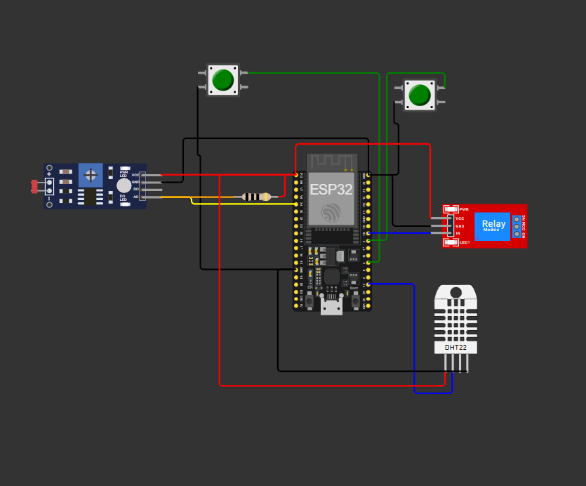

# FarmTechESP32 – Sistema de Irrigação Inteligente

## Descrição

Este projeto simula um sistema de irrigação inteligente utilizando ESP32, sensores de umidade, nutrientes (fósforo e potássio) e pH (simulado por LDR). O sistema aciona uma bomba d'água automaticamente conforme os valores dos sensores.

## Componentes Simulados

- **Fósforo (P):** Botão físico (pressionado = presença)
- **Potássio (K):** Botão físico (pressionado = presença)
- **pH:** Sensor LDR (valores analógicos simulam pH de 0 a 14)
- **Umidade do solo:** Sensor DHT22
- **Bomba d'água:** Relé
- **Status:** LED onboard

## Lógica de Controle

A bomba é ligada se:
- Fósforo ou potássio estiver ausente
- Umidade do solo < 40%
- pH < 5.5 ou pH > 7.5

## Circuito

## Como usar

1. Abra o projeto no VS Code com PlatformIO.
2. Compile e faça upload para o ESP32.
3. Monitore os dados pelo Serial Monitor.

---

## Armazenamento de Dados em Banco SQL (Python)

Após coletar dados do Serial Monitor, utilize o script Python (`armazenamento_sql.py`) para inserir, consultar, atualizar e remover dados em um banco SQLite.

Agora é possível importar automaticamente os dados do arquivo `dados_serial_exemplo.txt` para o banco, executando o script diretamente:

## Relação com o MER da Fase 2

O banco de dados utilizado neste projeto foi inspirado no Modelo Entidade-Relacionamento (MER) da Fase 2, que contempla entidades como produtor, plantação, cultura, sensor, sensor aplicado e leitura de sensor. Para a simulação e armazenamento dos dados coletados pelo ESP32, utilizamos uma tabela simplificada chamada `leituras`, que representa a entidade T_LEITURA_SENSOR do MER.

No MER, a entidade T_LEITURA_SENSOR possui os seguintes atributos principais:
- **id_leitura** (PK): Identificador único da leitura
- **id_sensor_aplicado** (FK): Referência ao sensor aplicado
- **data_hora**: Data e hora da leitura
- **valor**: Valor registrado pelo sensor

No projeto Python, a tabela `leituras` armazena:
- **timestamp**: Data e hora da leitura (equivalente a data_hora)
- **fosforo**: Presença/ausência de fósforo (simula valor do sensor de nutrientes)
- **potassio**: Presença/ausência de potássio (simula valor do sensor de nutrientes)
- **ph**: Valor do pH do solo
- **umidade**: Umidade do solo
- **bomba**: Status da bomba (ligada/desligada)
- **motivo**: Motivo do acionamento da bomba

Esses campos representam os valores registrados pelos sensores e o contexto da leitura, alinhando-se à proposta do MER, mesmo que de forma simplificada para a simulação.

## Operações CRUD implementadas

O script `armazenamento_sql.py` implementa as quatro operações básicas de banco de dados (CRUD):

- **Create (Criar):** Inserção de uma nova leitura no banco, usando a função `inserir_leitura`.
- **Read (Ler):** Consulta de todas as leituras armazenadas, usando a função `consultar_leituras`.
- **Update (Atualizar):** Atualização de uma leitura existente pelo ID, usando a função `atualizar_leitura`.
- **Delete (Remover):** Remoção de uma leitura pelo ID, usando a função `remover_leitura`.

Essas operações permitem gerenciar os dados coletados, facilitando análises, correções e integração futura com as demais entidades do MER, caso o sistema seja expandido.

---
